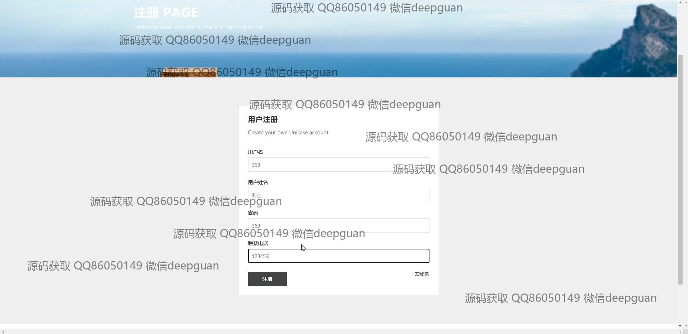

<h1 align="center">的体育运动商品交易商城系统vue</h1>

## 简介
体育运动商品交易商城系统：角色分为管理员、用户；功能包括商品信息管理、用户管理、订单管理、论坛管理、留言板管理，支持商品展示、购物车、评论互动等线上购物操作。    --计算机毕业设计源码；毕设源码；java毕业设计源码

## 联系方式

<h3 align="center">获取完整代码与数据库文件 + 微信：deepguan QQ: 86050149 QQ群: 783742310</h3>

<h3 align="center">可帮忙远程部署 包运行成功！提供远程部署、修改代码、设计文档指导、代码讲解等服务！</h3>

## 功能介绍（完整见运行截图）
管理员：基本功能包括登录、注册和退出。系统提供了管理首页，包含主导航栏与轮播图，支持访问商品分类、用户管理、订单管理、库存管理、出售信息管理和客服管理等功能模块。此外，还可编辑发布商品信息、新闻资讯和管理论坛帖子。系统提供商品信息管理功能，支持添加、修改和删除商品条目，上传商品图片和输入商品描述。同时，管理员能够管理配送信息和处理用户留言，确保商城运营顺畅。

用户：基本功能包括账户的登录、注册和退出。用户可通过网站首页的主导航栏浏览商品信息，查看商品详情页，添加商品至购物车并进行订单结算与付款。此外，用户界面允许注册和登录管理，包含个人信息的查看及修改、订单查询以及地址和收藏的管理。系统提供互动平台，如留言板、论坛等，以增进用户交流和参与。用户也可通过注册界面创建新账户，选择身份角色，并通过提供的登录功能顺利访问个人中心及商城服务。

## 运行截图

本代码来源于网络,仅供学习参考使用!

